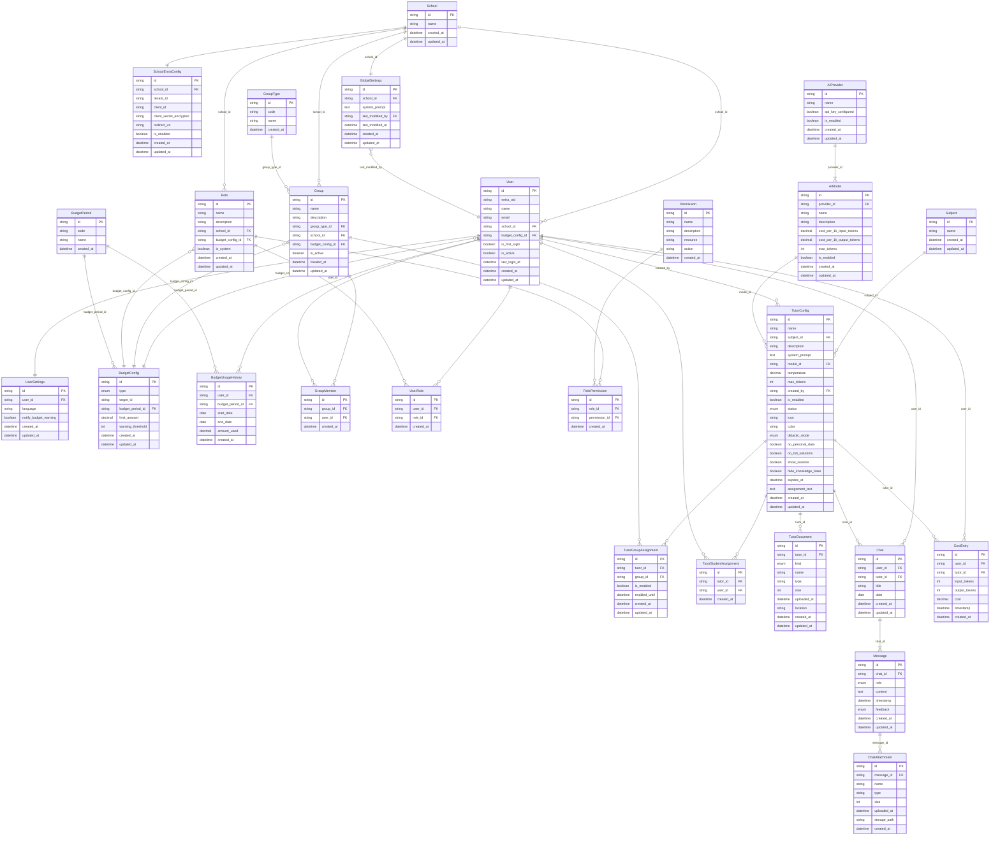

# Entity-Relationship-Diagramm (ERD) – Novedu

Dieses ERD leitet sich aus den **Requirements** und **Typen** des Projekts ab. Es beschreibt die logischen Entitäten, Attribute und Beziehungen für ein Schul-KI-Tutor-System mit Nutzerverwaltung, Tutoren-Konfiguration, Chats, Budgets und Kosten.

**Aktualisierung (Beschluss):** School verpflichtend; SchoolEntraConfig (1:1); **GlobalSettings** pro School (nicht pro User – User hat nur **UserSettings**). Kein Class – nur **Group** mit **GroupType**. Budget-Limits nur in **BudgetConfig** (type + target_id + limit_amount + budget_period_id + warning_threshold); User/Group/Role haben keine Budget-Felder mehr. **TutorDocument** (ein Tabelle, Diskriminator kind: knowledge|assignment). Chat: date statt school_year, ohne model_id und is_temporary. **MessageSource** entfernt (user/assistant steht in Message.role). CostEntry ohne model_id (Modell steckt im Tutor).

---

## 1. Kurzüberblick Domäne

- **Schule**: Jede Schule hat genau eine **School**-Zeile und optional eine **SchoolEntraConfig** (Entra-ID: Tenant, Client, Secret, Redirect-URI).
- **Nutzer**: Gehören zu einer School; Rolle nur über **UserRole** (kein role-enum). Ein Nutzer kann in mehreren **Gruppen** sein (Group = „Klasse“ im UI; GroupType z. B. Klasse, Freifachgruppe).
- **Gruppen**: Ein einheitliches Konzept **Group** mit **GroupType**; gehört zu einer School. Group kann ein Budget einrichten (optional **budget_config_id** → BudgetConfig).
- **Tutoren**: KI-Tutor-Konfigurationen; Zuweisung an Gruppen (TutorGroupAssignment) oder einzelne Schüler. Dokumente (Wissen/Aufgaben) in **TutorDocument** (Diskriminator kind).
- **Budgets**: User, Group und Role richten jeweils (optional) ein Budget ein – FK **budget_config_id** → **BudgetConfig** (limit_amount, BudgetPeriod, warning_threshold). Verbrauch in **BudgetUsageHistory**.
- **AI-Infrastruktur**: Provider und Modelle; Kosten pro 1k Tokens (Input/Output getrennt).

---

## 2. Entitäten und Attribute

### 2.1 User (Nutzer)

Die Rolle eines Nutzers ergibt sich ausschließlich über **UserRole** (n:m zu Role); es gibt kein role-enum. Zugehörigkeit zu „Klassen“/Gruppen nur über **GroupMember**.

| Feld            | Typ        | Beschreibung |
|-----------------|------------|--------------|
| id              | PK         | Eindeutige ID |
| entra_oid       | string?    | Microsoft Entra ID (Object ID) für SSO-Login; unique |
| name            | string     | Anzeigename |
| email           | string     | Login / E-Mail (eindeutig) |
| school_id        | FK         | → School (verpflichtend) |
| budget_config_id | FK?        | → BudgetConfig (optional; User richtet ein Budget ein) |
| is_first_login   | boolean?   | Erster Login / AGB noch nicht akzeptiert |
| is_active        | boolean?   | Konto aktiv/deaktiviert |
| last_login_at    | datetime?  | Letzter Login (für Admin/Support) |
| created_at       | datetime   | Anlagezeitpunkt |
| updated_at       | datetime   | Letzte Änderung |

**Beziehungen:** User N:1 School. User 0..1 BudgetConfig (budget_config_id – „richtet ein Budget ein“). User 1:1 UserSettings. Rolle nur über UserRole; Verbrauchshistorie in **BudgetUsageHistory**.

---

### 2.2 UserSettings (Nutzer-Einstellungen)

Eine Zeile pro User (1:1). Vorerst: Sprache und Budget-Warnung.

| Feld                 | Typ     | Beschreibung |
|----------------------|---------|--------------|
| id                   | PK      | Eindeutige ID |
| user_id              | FK      | → User (unique) |
| language             | string? | Sprachcode (z. B. de, en) |
| notify_budget_warning| boolean | E-Mail bei Budget-Warnung |
| created_at           | datetime| Anlagezeitpunkt |
| updated_at           | datetime| Letzte Änderung |

**Beziehung:** User 1:1 UserSettings.

---

### 2.3 School (Schule)

Schule ist verpflichtend; jede Nutzerin gehört genau einer School an. Pro School kann genau eine Entra-ID-Anbindung konfiguriert werden (siehe SchoolEntraConfig).

| Feld       | Typ      | Beschreibung |
|------------|----------|--------------|
| id         | PK       | Eindeutige ID |
| name       | string   | Schulname |
| created_at | datetime | Anlagezeitpunkt |
| updated_at | datetime | Letzte Änderung |

**Beziehungen:** User N:1 School. School 1:1 SchoolEntraConfig (optional). School 1:1 GlobalSettings (pro Schule eigene globale Einstellungen, z. B. System-Prompt).

---

### 2.4 SchoolEntraConfig (Entra-ID-Anbindung pro Schule)

Jede Schule kann genau eine Microsoft-Entra-ID-Anbindung haben (Tenant, Client, Secret, Redirect-URI). Für den Login werden typischerweise benötigt: **Tenant ID**, **Client ID (Application ID)**, **Client Secret** (verschlüsselt speichern), **Redirect URI**.

| Feld                     | Typ      | Beschreibung |
|--------------------------|----------|--------------|
| id                       | PK       | Eindeutige ID |
| school_id                | FK       | → School (unique; genau eine Config pro Schule) |
| tenant_id                | string   | Azure AD / Entra Tenant-ID der Organisation |
| client_id                | string   | Application (Client) ID der App-Registrierung |
| client_secret_encrypted  | string   | Client Secret verschlüsselt (oder Referenz auf Secret Manager) |
| redirect_uri             | string?  | Redirect-URI nach Login (kann pro Deployment gleich sein) |
| is_enabled               | boolean  | Entra-Login für diese Schule aktiv |
| created_at               | datetime | Anlagezeitpunkt |
| updated_at               | datetime | Letzte Änderung |

**Beziehung:** School 1:1 SchoolEntraConfig.

---

### 2.5 BudgetPeriod (Budget-Periode als Tabelle)

Statt enum: eigene Tabelle für Periodentypen (täglich, wöchentlich, monatlich, jährlich). Wird von **BudgetConfig** und **BudgetUsageHistory** referenziert.

| Feld       | Typ      | Beschreibung |
|------------|----------|--------------|
| id         | PK       | Eindeutige ID |
| code       | string   | Eindeutiger Code (z. B. daily, weekly, monthly, yearly) |
| name       | string   | Anzeigename (z. B. „Monatlich“) |
| created_at | datetime | Anlagezeitpunkt |

---

### 2.6 BudgetUsageHistory (Verbrauchshistorie pro Nutzer)

Statt „budget_used“ auf User: Tabelle mit Historie. Jeder Eintrag = ein abgeschlossener Zeitraum (start_date, end_date) mit dem in dieser Periode verbrauchten Betrag (amount_used). Periodentyp über budget_period_id (daily, monthly, …).

| Feld              | Typ      | Beschreibung |
|-------------------|----------|--------------|
| id                | PK       | Eindeutige ID |
| user_id           | FK       | → User |
| budget_period_id  | FK       | → BudgetPeriod |
| start_date        | date     | Beginn des Zeitraums |
| end_date          | date     | Ende des Zeitraums |
| amount_used       | decimal  | In diesem Zeitraum verbrauchter Betrag |
| created_at        | datetime | Buchungszeitpunkt |

**Beziehung:** User 1:n BudgetUsageHistory; BudgetPeriod 1:n BudgetUsageHistory.

---

### 2.7 GroupType (Gruppentyp)

Ein Gruppentyp kategorisiert eine **Group** (im Frontend oft „Klasse“; in der DB immer Group). Beispiele: Klasse, Freifachgruppe, Projektgruppe.

| Feld       | Typ      | Beschreibung |
|------------|----------|--------------|
| id         | PK       | Eindeutige ID |
| code       | string   | Eindeutiger Code (z. B. class, freifachgruppe) |
| name       | string   | Anzeigename (z. B. „Klasse“, „Freifachgruppe“) |
| created_at | datetime | Anlagezeitpunkt |

**Beziehung:** Group N:1 GroupType.

---

### 2.8 Group (Gruppe / „Klasse“ im Frontend)

Es gibt nur **Group** (kein separates „Class“). Im UI wird weiter von „Klasse“ gesprochen. Ein Nutzer kann in **mehreren** Gruppen sein (GroupMember). Group hat **keine** Budget-Felder – Limits nur in **BudgetConfig** (type=group, target_id=group.id).

| Feld            | Typ      | Beschreibung |
|-----------------|----------|--------------|
| id              | PK       | Eindeutige ID |
| name            | string   | Name (z. B. „10a“, „Mathe-AG“) |
| description     | string?  | Beschreibung |
| group_type_id    | FK       | → GroupType (Klasse, Freifachgruppe, …) |
| school_id        | FK       | → School |
| budget_config_id | FK?      | → BudgetConfig (optional; Group richtet ein Budget ein) |
| is_active        | boolean  | Gruppe aktiv (Archivierung ohne Löschen) |
| created_at       | datetime | Anlagezeitpunkt |
| updated_at       | datetime | Letzte Änderung |

**Beziehungen:** Group N:1 GroupType, N:1 School. Group 0..1 BudgetConfig (budget_config_id). User ↔ Group n:m über **GroupMember**.

---

### 2.9 GroupMember (Gruppe–Mitglied)

Ein Nutzer kann in mehreren Gruppen sein (z. B. eine Klasse + eine Freifachgruppe).

| Feld       | Typ      | Beschreibung |
|------------|----------|--------------|
| id         | PK       | Eindeutige ID |
| group_id   | FK       | → Group |
| user_id    | FK       | → User |
| created_at | datetime | Zuordnungszeitpunkt |

**Unique:** (group_id, user_id).

---

### 2.10 Role (Rolle – benutzerdefiniert)

Rollen mit Rechten über **RolePermission**. Rollen sind **pro Schule** (school_id). Admin/Teacher/Student sind Rollen (is_system = true). **Keine** Budget-Felder auf Role – Limits nur in **BudgetConfig** (type=role, target_id=role.id).

| Feld        | Typ      | Beschreibung |
|-------------|----------|--------------|
| id          | PK       | Eindeutige ID |
| name             | string   | Rollenname (z. B. „Admin“, „Lehrer“, „Schüler“, „Tutor“) |
| description      | string?  | Beschreibung |
| school_id        | FK       | → School (Rolle gehört zu einer Schule) |
| budget_config_id | FK?      | → BudgetConfig (optional; Role richtet ein Budget ein) |
| is_system        | boolean  | Systemrolle (nicht löschbar) |
| created_at       | datetime | Anlagezeitpunkt |
| updated_at       | datetime | Letzte Änderung |

**Beziehungen:** Role N:1 School. Role 0..1 BudgetConfig (budget_config_id). User ↔ Role n:m über **UserRole**. Role ↔ Permission n:m über **RolePermission**.

---

### 2.11 Permission (Berechtigung)

Feingranulare Rechte für Custom Roles (resource + action).

| Feld        | Typ      | Beschreibung |
|-------------|----------|--------------|
| id          | PK       | Eindeutige ID |
| name        | string   | Lesbarer Name |
| description | string?  | Beschreibung |
| resource    | string   | Ressource (z. B. „tutor“, „budget“, „global_prompt“) |
| action      | string   | Aktion (z. B. „create“, „edit“, „delete“, „view“) |
| created_at  | datetime | Anlagezeitpunkt |

**Beziehung:** Role ↔ Permission n:m über **RolePermission**.

---

### 2.12 RolePermission (Rolle–Berechtigung)

| Feld          | Typ      | Beschreibung |
|---------------|----------|--------------|
| id            | PK       | Eindeutige ID |
| role_id       | FK       | → Role |
| permission_id | FK       | → Permission |
| created_at    | datetime | Zuordnungszeitpunkt |

**Unique:** (role_id, permission_id).

---

### 2.13 UserRole (Nutzer–Rolle)

| Feld      | Typ      | Beschreibung |
|-----------|----------|--------------|
| id        | PK       | Eindeutige ID |
| user_id   | FK       | → User |
| role_id   | FK       | → Role |
| created_at| datetime | Zuordnungszeitpunkt |

**Unique:** (user_id, role_id).

---

### 2.14 Subject (Fach)

Zentrale Fächerliste (z. B. Mathematik, Deutsch); TutorConfig referenziert ein Fach.

| Feld       | Typ      | Beschreibung |
|------------|----------|--------------|
| id         | PK       | Eindeutige ID |
| name       | string   | Fachname |
| created_at | datetime | Anlagezeitpunkt |
| updated_at | datetime | Letzte Änderung |

**Beziehung:** TutorConfig N:1 Subject (subject_id).

---

### 2.15 AIProvider (KI-Anbieter)

| Feld               | Typ     | Beschreibung |
|--------------------|---------|--------------|
| id                 | PK       | Eindeutige ID (z. B. „openai“, „anthropic“) |
| name               | string   | Anzeigename |
| api_key_configured | boolean  | API-Key hinterlegt |
| is_enabled         | boolean  | Anbieter aktiv |
| created_at         | datetime | Anlagezeitpunkt |
| updated_at         | datetime | Letzte Änderung |

**Beziehung:** AIProvider 1:n AIModel.

---

### 2.16 AIModel (KI-Modell)

Viele APIs haben getrennte Preise für Input- und Output-Tokens.

| Feld                        | Typ      | Beschreibung |
|-----------------------------|----------|--------------|
| id                          | PK       | Eindeutige ID (z. B. „gpt-4“) |
| provider_id                 | FK       | → AIProvider |
| name                        | string   | Anzeigename |
| description                 | string?  | Kurzbeschreibung |
| cost_per_1k_input_tokens    | decimal  | Kosten pro 1000 Input-Tokens |
| cost_per_1k_output_tokens   | decimal  | Kosten pro 1000 Output-Tokens |
| max_tokens                  | int      | Maximale Kontextlänge |
| is_enabled                  | boolean  | Modell aktiv |
| created_at                  | datetime | Anlagezeitpunkt |
| updated_at                  | datetime | Letzte Änderung |

---

### 2.17 TutorConfig (Tutor-Konfiguration)

Konfiguration eines „KI-Tutors“ (Fach, Modell, Prompt, Zuweisungen).

| Feld                | Typ      | Beschreibung |
|---------------------|----------|--------------|
| id                  | PK       | Eindeutige ID |
| name                | string   | Anzeigename (z. B. „Mathe-Meister“) |
| subject_id          | FK       | → Subject |
| description         | string?  | Kurzbeschreibung |
| system_prompt       | text     | System-Prompt für die KI |
| model_id            | FK       | → AIModel |
| temperature         | decimal  | KI-Parameter |
| max_tokens          | int      | Max. Tokens pro Antwort |
| created_by          | FK       | → User (Ersteller, typ. Lehrer) |
| is_enabled          | boolean  | Tutor global aktiv |
| status              | enum     | `draft` \| `published` |
| icon                | string?  | Icon (Emoji/Kürzel) |
| color               | string?  | Farbe (UI) |
| didactic_mode       | enum?    | `socratic` \| `hints` \| `step-by-step` \| `concise` |
| no_personal_data    | boolean? | Sicherheitsregel: keine personenbezogenen Daten |
| no_full_solutions   | boolean? | Sicherheitsregel: keine Komplettlösungen |
| show_sources        | boolean? | Quellen in Antworten anzeigen |
| hide_knowledge_base | boolean? | Wissensbasis vor Nutzer verbergen |
| expires_at          | datetime?| Gültig bis (z. B. Schuljahresende) |
| assignment_text     | text?    | Aufgabenstellung (Freitext) |
| created_at          | datetime | Erstellzeit |
| updated_at          | datetime | Letzte Änderung |

**Beziehungen:**

- TutorConfig N:1 User (created_by), N:1 Subject (subject_id), N:1 AIModel (model_id).
- TutorConfig n:m Group über **TutorGroupAssignment** (dort pro Gruppe is_enabled, enabled_until).
- TutorConfig n:m User über **TutorStudentAssignment** (direkte Schülerzuweisung).

---

### 2.18 TutorGroupAssignment (Tutor ↔ Gruppe)

Aktivierung pro Gruppe: Tutor kann für eine Gruppe (z. B. „Klasse 10a“) ein- oder ausgeschaltet sein; optional Gültigkeit bis zu einem Datum.

| Feld          | Typ      | Beschreibung |
|---------------|----------|--------------|
| id            | PK       | Eindeutige ID |
| tutor_id      | FK       | → TutorConfig |
| group_id      | FK       | → Group |
| is_enabled    | boolean  | Tutor für diese Gruppe aktiv |
| enabled_until | datetime?| Gültig bis (z. B. Schuljahresende) |
| created_at    | datetime | Zuordnungszeitpunkt |
| updated_at    | datetime | Letzte Änderung |

**Unique:** (tutor_id, group_id).  
Bedeutung: Tutor ist für alle Mitglieder dieser Gruppe sichtbar/nutzbar, wenn is_enabled und (enabled_until null oder in der Zukunft).

---

### 2.19 TutorStudentAssignment (Tutor ↔ Schüler)

| Feld       | Typ      | Beschreibung |
|------------|----------|--------------|
| id         | PK       | Eindeutige ID |
| tutor_id   | FK       | → TutorConfig |
| user_id    | FK       | → User |
| created_at | datetime | Zuordnungszeitpunkt |

**Unique:** (tutor_id, user_id).  
Bedeutung: Explizite Zuweisung eines Tutors zu einzelnen Schülern (z. B. Förderung).

---

### 2.20 TutorDocument (Tutor-Dokument: Wissen oder Aufgabe)

Eine Tabelle mit **Diskriminator** kind: Wissensdokument (Knowledge) oder Aufgabendokument (Assignment). **Ein Feld location** reicht: entweder eigener Storage-Pfad (hochgeladenes Dokument) oder externe URL (z. B. Link zum Arbeitsblatt) – je nach Nutzung.

| Feld        | Typ      | Beschreibung |
|-------------|----------|--------------|
| id          | PK       | Eindeutige ID |
| tutor_id    | FK       | → TutorConfig |
| kind        | enum     | `knowledge` \| `assignment` (Diskriminator) |
| name        | string   | Dateiname |
| type        | string   | MIME-Type |
| size        | int      | Größe in Bytes |
| uploaded_at | datetime | Hochladezeit |
| location    | string   | Storage-Pfad (eigenes System) oder URL (externer Link) |
| created_at  | datetime | Anlagezeitpunkt |
| updated_at  | datetime | Letzte Änderung |

**Beziehung:** TutorConfig 1:n TutorDocument.

---

### 2.21 Chat (Konversation)

Eine Chat-Session zwischen einem Nutzer und optional einem Tutor. Modell kommt vom Tutor (kein model_id auf Chat). Nur persistierte Chats werden gespeichert (kein is_temporary).

| Feld       | Typ      | Beschreibung |
|------------|----------|--------------|
| id         | PK       | Eindeutige ID |
| user_id    | FK       | → User |
| tutor_id   | FK?      | → TutorConfig (null = freier Chat) |
| title      | string   | Anzeigename (z. B. erster Nachrichtentitel) |
| date       | date     | Referenzdatum (z. B. Erstelltag) |
| created_at | datetime | Erstellzeit |
| updated_at | datetime | Letzte Aktivität |

**Beziehungen:** Chat N:1 User, N:1 TutorConfig (optional); Chat 1:n Message.

---

### 2.23 Message (Nachricht)

| Feld        | Typ     | Beschreibung |
|-------------|---------|--------------|
| id          | PK      | Eindeutige ID |
| chat_id     | FK      | → Chat |
| role        | enum    | `user` \| `assistant` |
| content     | text    | Nachrichtentext |
| timestamp   | datetime| Sendezeit |
| feedback    | enum?   | `positive` \| `negative` (Nutzer-Feedback) |

**Beziehung:** Message N:1 Chat. Ob Nachricht von User oder KI kommt, steht in **role** (user|assistant). 1:n **ChatAttachment** (Anhänge).

---

### 2.24 ChatAttachment / MessageAttachment (Anhänge)

Anhänge können konzeptionell auf Chat-Ebene oder auf Message-Ebene liegen (laut Typen beides möglich). Einheitlich als Anhang pro Nachricht:

| Feld        | Typ      | Beschreibung |
|-------------|----------|--------------|
| id          | PK       | Eindeutige ID |
| message_id  | FK       | → Message (oder chat_id, je nach Modell) |
| name        | string   | Dateiname |
| type        | string   | MIME-Type |
| size        | int      | Größe |
| uploaded_at | datetime | Hochladezeit |
| storage_path| string?  | Pfad/URL im Storage |
| created_at  | datetime | Anlagezeitpunkt |

---

### 2.26 BudgetConfig (Budget-Konfiguration)

User, Group und Role **richten jeweils (optional) ein Budget ein** – jede Entität hat dafür einen optionalen FK **budget_config_id** → BudgetConfig. Zusätzlich type + target_id auf BudgetConfig für Abfragen (polymorph).

| Feld               | Typ      | Beschreibung |
|--------------------|----------|--------------|
| id                 | PK       | Eindeutige ID |
| type               | enum     | `role` \| `group` \| `user` |
| target_id          | string   | ID der Zielentität (Role, Group oder User) |
| budget_period_id   | FK       | → BudgetPeriod |
| limit_amount       | decimal  | Max. Betrag in dieser Periode |
| warning_threshold  | int      | Warnung bei X % (0–100) |
| created_at         | datetime | Anlagezeitpunkt |
| updated_at         | datetime | Letzte Änderung |

**Beziehungen:** User 0..1 BudgetConfig (budget_config_id), Group 0..1 BudgetConfig (budget_config_id), Role 0..1 BudgetConfig (budget_config_id). Verbrauch wird aus CostEntry/BudgetUsageHistory berechnet.

---

### 2.27 CostEntry (Kostenbuchung)

Eine abrechnungsrelevante Nutzung (z. B. pro Request). Modell kommt über den Tutor (kein model_id auf CostEntry). Input-/Output-Tokens getrennt; Kosten aus TutorConfig.model → AIModel-Preise.

| Feld          | Typ      | Beschreibung |
|---------------|----------|--------------|
| id            | PK       | Eindeutige ID |
| user_id       | FK       | → User |
| tutor_id      | FK       | → TutorConfig (Modell über tutor.model_id) |
| input_tokens  | int      | Verbrauchte Input-Tokens |
| output_tokens | int      | Verbrauchte Output-Tokens |
| cost          | decimal  | Berechnete Kosten |
| timestamp     | datetime | Zeitpunkt der Nutzung |
| created_at    | datetime | Buchungszeitpunkt |

**Beziehungen:** CostEntry N:1 User, N:1 TutorConfig. Quelle für **BudgetUsageHistory** und für Auswertung von BudgetConfig.

---

### 2.28 GlobalSettings (Schul-Einstellungen)

**Eine Schule hat GlobalSettings** (1:1). Ein **User** hat **UserSettings** – nicht GlobalSettings. GlobalSettings = z. B. System-Prompt für alle Tutoren dieser Schule.

| Feld              | Typ      | Beschreibung |
|-------------------|----------|--------------|
| id                | PK       | Eindeutige ID |
| school_id         | FK       | → School (unique; genau eine Zeile pro Schule) |
| system_prompt     | text     | Globaler System-Prompt für alle Tutoren dieser Schule |
| last_modified_by  | FK?      | → User (nur Audit: wer zuletzt geändert hat) |
| last_modified_at  | datetime | Letzte Änderung |
| created_at        | datetime | Anlagezeitpunkt |
| updated_at        | datetime | Letzte Änderung |

**Beziehung:** School 1:1 GlobalSettings. User hat ausschließlich UserSettings.

---

## 3. Beziehungsübersicht (logisch)

| Von             | Beziehung | Nach              | Kardinalität | Vermittlung / Anmerkung |
|-----------------|-----------|-------------------|--------------|--------------------------|
| School          | hat       | SchoolEntraConfig | 1:1          | genau eine Config pro Schule |
| School          | hat       | GlobalSettings    | 1:1          | school_id (pro Schule eigene Einstellungen) |
| School          | hat       | Role              | 1:n          | school_id (Rollen pro Schule) |
| User            | gehört zu | School            | N:1          | school_id (pflicht)      |
| User            | hat       | UserSettings      | 1:1          | user_id                 |
| User            | hat Verbrauch | BudgetUsageHistory | 1:n       | user_id, budget_period_id, start/end |
| User            | hat Rolle | Role              | n:m          | UserRole                |
| User            | ist in    | Group             | n:m          | GroupMember (mehrere Gruppen möglich) |
| Role            | gehört zu | School            | N:1          | school_id                |
| Role            | hat       | Permission        | n:m          | RolePermission          |
| Group           | hat Typ   | GroupType         | N:1          | group_type_id            |
| Group           | gehört zu | School            | N:1          | school_id                |
| TutorConfig     | hat Fach  | Subject           | N:1          | subject_id               |
| TutorConfig     | hat       | TutorDocument     | 1:n          | tutor_id (kind: knowledge\|assignment) |
| TutorConfig     | zugewiesen Gruppen | Group | n:m    | TutorGroupAssignment    |
| TutorConfig     | zugewiesen Schüler | User  | n:m    | TutorStudentAssignment  |
| User            | richtet ein Budget ein | BudgetConfig | 0..1         | budget_config_id       |
| Group           | richtet ein Budget ein | BudgetConfig | 0..1         | budget_config_id       |
| Role            | richtet ein Budget ein | BudgetConfig | 0..1         | budget_config_id       |
| BudgetConfig    | nutzt Periode | BudgetPeriod  | N:1          | budget_period_id       |
| BudgetConfig    | bezieht sich auf | Role/Group/User | 1:1 (pro Ziel) | type + target_id (polymorph) |
| Chat            | gehört Nutzer | User         | N:1          | user_id                 |
| CostEntry       | verbraucht von | User        | N:1          | user_id (Modell über Tutor) |
| AIProvider      | hat       | AIModel           | 1:n          | provider_id             |
| GlobalSettings  | gehört zu    | School      | N:1          | school_id               |
| GlobalSettings  | zuletzt geändert von | User | N:1 (opt.) | last_modified_by (Audit) |

---

## 4. ERD (Mermaid)

---

## 5. Abgeleitete Anforderungen (Kernlogik)

- **Sichtbarkeit Tutoren:** Ein Tutor ist für einen Nutzer sichtbar, wenn  
  - der Nutzer in einer zugewiesenen **Gruppe** (TutorGroupAssignment, is_enabled, enabled_until) ist **oder**  
  - der Nutzer explizit dem Tutor zugewiesen ist (TutorStudentAssignment), und der Tutor `published` und `is_enabled` ist.
- **Rolle:** Kein role-enum auf User; Rolle ausschließlich über UserRole (und ggf. primary Role) ableiten. Admin/Lehrer/Schüler sind Einträge in Role (is_system = true).
- **Budgets:** User, Group und Role richten jeweils (optional) ein Budget ein – FK **budget_config_id** → **BudgetConfig** (limit_amount, budget_period_id, warning_threshold). Verbrauch in **BudgetUsageHistory** (start_date, end_date, amount_used).
- **Kosten:** Pro Nutzung eine CostEntry (user_id, tutor_id, input_tokens, output_tokens, cost). Modell und Preise über TutorConfig.model_id → AIModel.
- **Globaler Prompt:** Pro Schule: GlobalSettings.system_prompt (School 1:1 GlobalSettings) wird bei jedem Tutor-Request dieser Schule zusätzlich zum tutor-spezifischen system_prompt verwendet.

---

Dieses ERD bildet die im Code und in den Mock-Daten erkennbaren Anforderungen ab und kann als Grundlage für ein physisches Datenbank-Schema (z. B. PostgreSQL) oder für eine API-Datenmodellierung verwendet werden.
